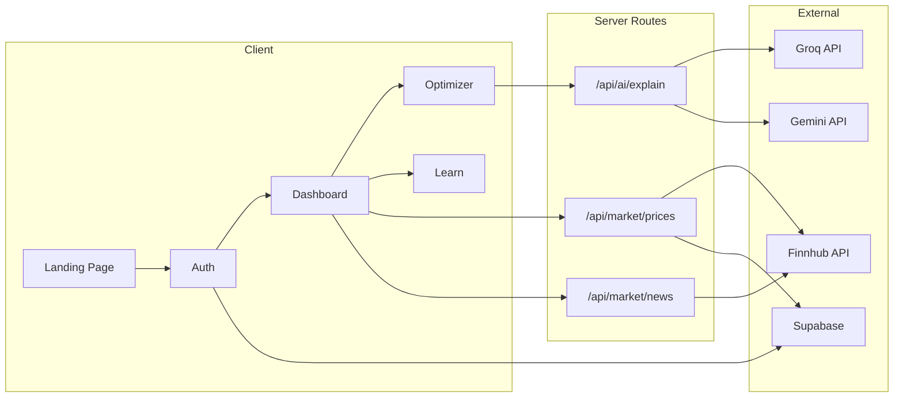

# SimpliFolio

> **AI-powered quant portfolio optimization for beginner retail investors.**

Wall Street math, explained by AI, zero cost.


---

## ✨ Features

| Feature                      | Description                                                                                           |
| ---------------------------- | ----------------------------------------------------------------------------------------------------- |
| **📊 Live Market Dashboard** | Real-time stock prices & news with intelligent API caching via Supabase                               |
| **⚡ Portfolio Optimizer**   | Monte Carlo simulation (5,000 trials) to find the max Sharpe Ratio allocation                         |
| **🧠 AI Explanations**       | ELI5 breakdowns of complex portfolio metrics using Groq (primary) + Gemini (fallback)                 |
| **📚 Learning Modules**      | 5 beginner-friendly investing lessons — from "What Is a Stock?" to "How Portfolio Optimization Works" |
| **🔐 Authentication**        | Supabase Auth with email sign-up, session persistence, and route protection                           |

---

## 🏗️ Architecture



**Data Flow:** External API → Next.js server route → Supabase cache → React UI

- All external API calls happen server-side (never from client)
- Quant engine runs in the browser using `mathjs` (fast, zero server cost)
- AI explanation uses Groq as primary, Gemini as fallback, raw metrics as final fallback

---

## 🛠️ Tech Stack

| Layer     | Technology            | Purpose                                      |
| --------- | --------------------- | -------------------------------------------- |
| Frontend  | Next.js 16 + React 19 | App Router, server routes, SSR               |
| Styling   | Tailwind CSS 4        | Utility-first CSS with custom design tokens  |
| Auth & DB | Supabase              | Authentication, PostgreSQL, market cache     |
| Charts    | Recharts              | Portfolio visualization                      |
| Math      | mathjs                | Portfolio variance, covariance, Sharpe ratio |
| AI        | Groq + Gemini         | ELI5 portfolio explanations                  |
| Data      | Finnhub               | Live stock prices & market news              |
| Deploy    | Vercel                | Zero-config deployment                       |

---

## 📁 Project Structure

```
src/
├── app/
│   ├── page.tsx                     # Landing page
│   ├── layout.tsx                   # Root layout + AuthProvider
│   ├── globals.css                  # Design system (glass cards, gradients)
│   ├── auth/page.tsx                # Sign in / Sign up
│   ├── dashboard/
│   │   ├── page.tsx                 # Market prices + news + quick links
│   │   ├── optimizer/page.tsx       # Portfolio optimizer + AI explanation
│   │   └── learn/page.tsx           # 5 learning modules (accordion)
│   └── api/
│       ├── market/prices/route.ts   # Finnhub prices → Supabase cache
│       ├── market/news/route.ts     # Finnhub news → Supabase cache
│       └── ai/explain/route.ts      # Groq/Gemini ELI5 generation
├── components/
│   ├── AuthProvider.tsx             # Supabase auth context
│   ├── PriceCard.tsx                # Stock price display card
│   ├── NewsFeed.tsx                 # News article list
│   ├── PortfolioInput.tsx           # Asset selection + weight input
│   ├── PortfolioResults.tsx         # Metrics comparison table + charts
│   └── ELI5Card.tsx                 # AI explanation card
└── lib/
    └── quant.ts                     # Portfolio math (returns, variance, Sharpe, Monte Carlo)
```

---

## 🚀 Getting Started

### Prerequisites

- Node.js 18+
- npm

### 1. Clone

```bash
git clone https://github.com/scarfl1ck1012/SimpliFolio.git
cd SimpliFolio
```

### 2. Install Dependencies

```bash
npm install
```

### 3. Environment Variables

Create `.env.local` in the project root:

```env
# Supabase
NEXT_PUBLIC_SUPABASE_URL=your_supabase_url
NEXT_PUBLIC_SUPABASE_ANON_KEY=your_supabase_anon_key

# Market Data
FINNHUB_API_KEY=your_finnhub_key

# AI (ELI5 Explanations)
GROQ_API_KEY=your_groq_key
GEMINI_API_KEY=your_gemini_key
```

### 4. Run

```bash
npm run dev
```

Open [http://localhost:3000](http://localhost:3000)

---

## 📝 Git History

| Commit    | Description                                                          |
| --------- | -------------------------------------------------------------------- |
| `c18d943` | feat: add learning modules with 5 beginner-friendly lessons          |
| `96a1e2c` | feat: add AI portfolio explanation with Groq/Gemini fallback         |
| `426c8c7` | feat: build portfolio optimizer with Monte Carlo Sharpe maximization |
| `732b12a` | feat: add live market prices and news dashboard with caching         |
| `e13de35` | feat: add Supabase authentication with session persistence           |
| `08036e6` | Initial commit from Create Next App                                  |

---

## 📄 License

MIT — built as a developer portfolio piece by **Manan**.
